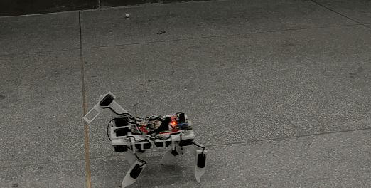
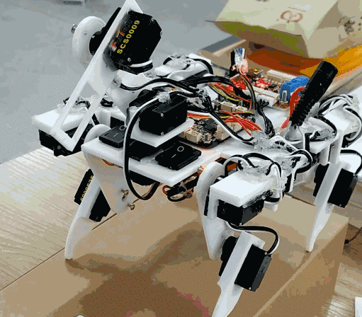
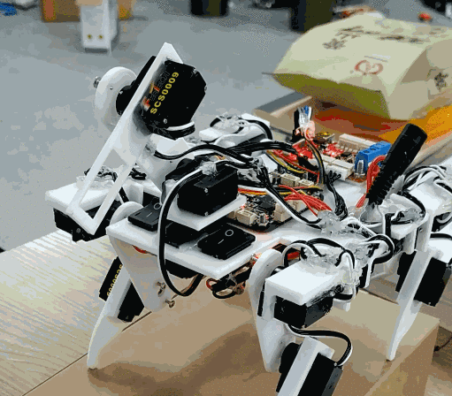

# RobotDog机器狗
小型四足机器人源码

## 资源总览
* 机械设计：SolidWorks 2016
* 结构材料：PLA 3D打印
* 电机：飞特SCS0009舵机
* 电池：12V锂电池
* 控制芯片：遥控器：STM32F103C8T6；机器狗：STM32F405RGT6
* 无线通信模块：NRF24L01
* 陀螺仪：MPU6050
* 开发环境：STM32CubeMX+Keil 5
* 代码库：遥控器：HAL库；机器狗：HAL库+FreeRTOS

## 文件说明
`RobotDog`是四足机器人的代码，`RobotDog_Remote`是四足机器人的遥控器的代码。每个文件夹里面都有一个STM32CubeMX工程`.ioc`文件，可以使用STM32CubeMX打开重新生成工程文件。

## 机器人功能展示
* 全向移动

* 狗头稳定

* 更多细节待你发现

## 代码详解
参见以下文章：

* [四足机器人制作（一） 腿部运动算法](https://imuncle.github.io/content.html?id=61)
* [四足机器人制作（二） 姿态解析](https://imuncle.github.io/content.html?id=62)
* [四足机器人制作（三） 全向移动](https://imuncle.github.io/content.html?id=63)
* [四足机器人制作（四） 云台稳定](https://imuncle.github.io/content.html?id=64)
* [四足机器人制作 （五） 代码实现](https://imuncle.github.io/content.html?id=73)
* [四足机器人制作（六） 更便捷的姿态解析](https://imuncle.github.io/content.html?id=74)